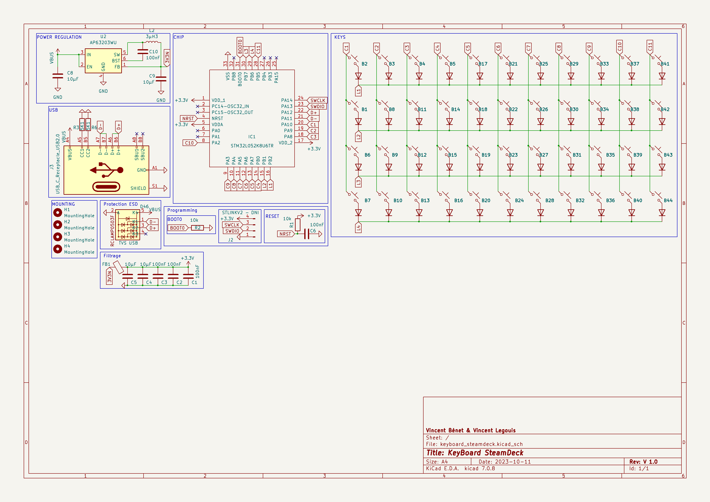
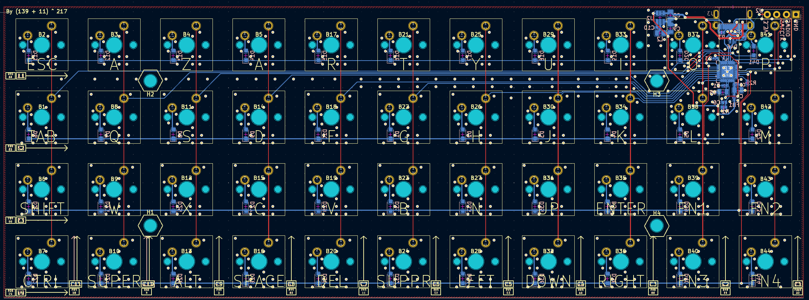
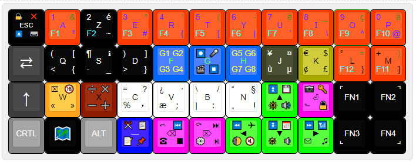
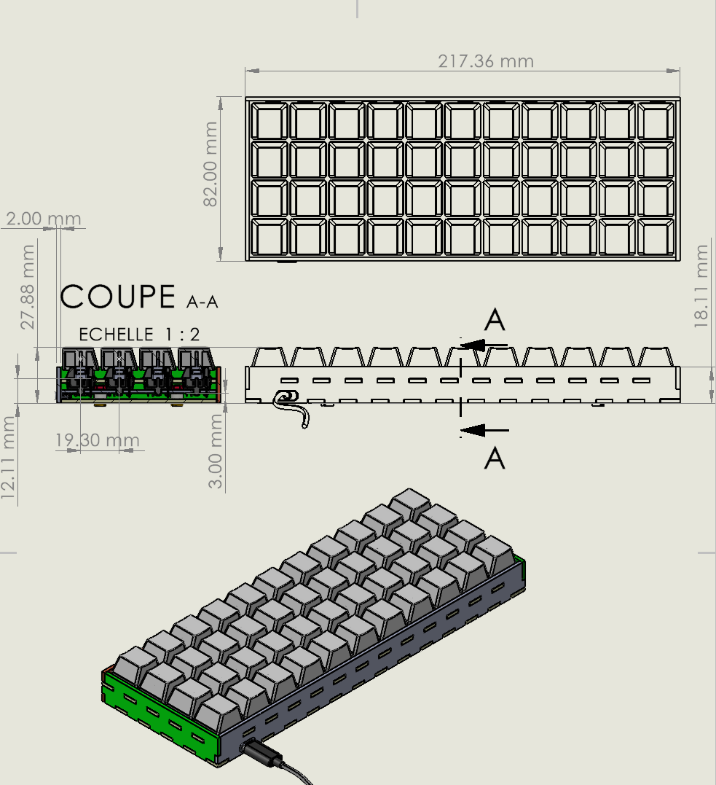

# keyboard_steamdeck

[Github](https://github.com/vincentBenet/keyboard_steamdeck)
[Author: Vincent Bénet](https://github.com/vincentBenet)

## Introduction

This project aim to create a minimalist custom keyboard using standard keycaps.
The goal is to have no keys restriction compare to a 120% keyboard.

### Schematic

### Routing

### Layout

[layout](http://www.keyboard-layout-editor.com/##@@_c=%23000000&t=%23ffffff&f:2%3B&=%F0%9F%94%8F%0A%E2%8F%8F%EF%B8%8F%0A%E2%9D%8C%0A%E2%8C%A8%0A%0A%0A%0A%0A%0AESC&_c=%23ff3b00&t=%234000ff%0A%2300ffde%0A%23337000&f:3%3B&=1%0AF1%0A%2F&%0A%C2%B2%0A%0A%0A%0A%0A%0AA&_c=%23000000&t=%23ffffff%0A%2300ffde%3B&=2%0AF2%0A%C3%A9%0A~%0A%0A%0A%0A%0A%0AZ&_c=%23ff3b00&t=%234000ff%0A%2300ffde%0A%23337000%3B&=3%0AF3%0A%22%0A%23%0A%0A%0A%0A%0A%0AE&=4%0AF4%0A'%0A%7B%0A%0A%0A%0A%0A%0AR&=5%0AF5%0A(%0A%5B%0A%0A%0A%0A%0A%0AT&=6%0AF6%0A-%0A%7C%0A%0A%0A%0A%0A%0AY&=7%0AF7%0A%C3%A8%0A%60%0A%0A%0A%0A%0A%0AU&=8%0AF8%0A%2F_%0A%5C%0A%0A%0A%0A%0A%0A%E2%85%A0&=9%0AF9%0A%C3%A7%0A%5E%0A%0A%0A%0A%0A%0AO&=0%0AF10%0A%C3%A0%0A%2F@%0A%0A%0A%0A%0A%0AP%3B&@_c=%233d3d3d&t=%23ffffff&a:7&f:9%3B&=%E2%87%84&_c=%23000000&a:4&f:3%3B&=(%0A%3C%0A%5B%0A%7B%0A%0A%0A%0A%0A%0AQ&=%C2%B6%0A-%0A%E2%84%B9%EF%B8%8F%0A%2F_%0A%0A%0A%0A%0A%0AS&=)%0A%3E%0A%5D%0A%7D%0A%0A%0A%0A%0A%0AD&_c=%230068ff&t=%23fff300%0A%0A%0A%0A%0A%0A%0A%0A%0A%2300ff17%3B&=G1%0AG3%0AG2%0AG4%0A%0A%0A%0A%0A%0AF&_t=%23a32424%0A%0A%0A%23ff0000%0A%0A%0A%0A%0A%0A%2300ff17%3B&=%E2%8F%BA%0A%F0%9F%8E%AC%0A%F0%9F%8E%A4%0A%E2%8F%B9%0A%0A%0A%0A%0A%0AG&_t=%23fff300%0A%0A%0A%0A%0A%0A%0A%0A%0A%2300ff17%3B&=G5%0AG7%0AG6%0AG8%0A%0A%0A%0A%0A%0AH&_c=%233c4225&t=%23ffffff%3B&=%C2%A5%0A%C3%B9%0A%C2%A4%0A%C2%B5%0A%0A%0A%0A%0A%0AJ&_c=%23a7a800&t=%23000000%3B&=%E2%82%AC%0A%C2%A2%0A$%0A%C2%A3%0A%0A%0A%0A%0A%0AK&_c=%23ff3b00&t=%23000000%0A%2300ffde%0A%23337000%3B&=%C2%B0%0AF12%0A%2F=%0A%7D%0A%0A%0A%0A%0A%0AL&=+%0AF11%0A)%0A%5D%0A%0A%0A%0A%0A%0AM%3B&@_c=%233d3d3d&t=%23ffffff&a:7&f:9%3B&=%E2%86%91&_c=%23ffa31a&t=%23000000&a:4&f:3%3B&=%E2%8C%A7%0A%C2%AB%0A%F0%9F%94%9E%0A%C2%BB%0A%0A%0A%0A%0A%0AW&_c=%238c1b00%3B&=%E2%9E%97%0A%E2%9E%96%0A%E2%9C%96%EF%B8%8F%0A%E2%9E%95%0A%0A%0A%0A%0A%0AX&_c=%23ffffff%3B&=%2F=%0A%EF%BC%85%0A%3F%0A%EF%B9%90%0A%0A%0A%0A%0A%0AC&=%C2%BF%0A%C3%A6%0A%E2%80%A7%0A%EF%BC%9B%0A%0A%0A%0A%0A%0AV&=%5C%0A%7C%0A%2F%2F%0A%EF%BC%9A%0A%0A%0A%0A%0A%0AB&=%E2%80%9C%0A%E2%80%9E%0A%C2%A7%0A!%0A%0A%0A%0A%0A%0AN&_c=%230bff00%3B&=%E2%8F%AB%0A%F0%9F%94%86%0A%F0%9F%92%BE%0A%F0%9F%94%8A%0A%0A%0A%0A%0A%0A%E2%96%B2&_c=%23ff00e8%3B&=%F0%9F%93%B7%0A%E2%AC%91%0A%F0%9F%94%91%0A%F0%9F%94%92%0A%0A%0A%0A%0A%0A%E2%8F%8E&_c=%23000000&t=%23ffffff%3B&=%E2%8C%9C%0A%0A%0A%0A%0A%0A%0A%0A%0AFN1&=%0A%0A%E2%8C%9D%0A%0A%0A%0A%0A%0A%0AFN2%3B&@_c=%23878787&a:7%3B&=CRTL&_c=%23000000&f:9%3B&=%F0%9F%97%BA%EF%B8%8F&_c=%238e8e8e&f:3%3B&=ALT&_c=%23000bff&a:4%3B&=%E2%9C%82%EF%B8%8F%0A%F0%9F%93%9D%0A%F0%9F%93%8B%0A%F0%9F%93%8C%0A%0A%0A%0A%0A%0A%E2%80%95&_c=%23ff00e8&t=%23000000%3B&=%E2%A4%BA%0A%E2%98%8E%0A%E2%8F%AE%0A%E2%8F%B9%0A%0A%0A%0A%0A%0A%E2%8C%AB&=%E2%A4%BC%0A%E2%9A%99%EF%B8%8F%0A%E2%8F%AD%0A%E2%8F%AF%0A%0A%0A%0A%0A%0A%E2%8C%A6&_c=%230bff00%3B&=%E2%8F%AA%0A%F0%9F%8C%93%0A%E2%9C%88%0A%F0%9F%94%87%0A%0A%0A%0A%0A%0A%E2%97%84&=%E2%8F%AC%0A%F0%9F%94%85%0A%F0%9F%93%85%0A%F0%9F%94%89%0A%0A%0A%0A%0A%0A%E2%96%BC&=%E2%8F%A9%0A%E2%9C%89%0A%F0%9F%93%B6%0A%E2%99%AB%0A%0A%0A%0A%0A%0A%E2%96%BA&_c=%23000000&t=%23ffffff%3B&=%0A%E2%8C%9E%0A%0A%0A%0A%0A%0A%0A%0AFN3&=%0A%0A%0A%E2%8C%9F%0A%0A%0A%0A%0A%0AFN4)

### Model 3D

## Features
Bellow a list of features of this keyboard:
    * All keys from 120% keyboards (Directionnal arrows, del, backspace, G keys)
    * Possibility to switch from AZERTY to QWERTY
    * 8 programables macro-G-keys
    * Up to 6 differents keys mapped on one switch (FN1, FN2, FN3, FN4, SHIFT, Simple press)
    * Reprogramming possibility of firmware
    * Electro Static Protection using TVS USB
    * Very low energy consumption using STM32L0 Chip
    * Case-material versatile (Wood, Aluminium, Inox, plastic, ...) (2mm cutted sheet)
    
    
    